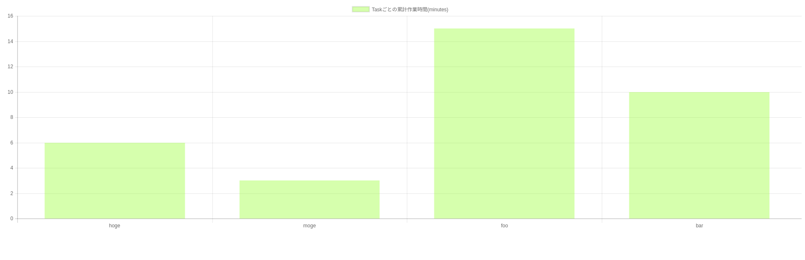

# gomato
Pomodoro Timer in Console written in golang.

## Installation

```console
$ go get -u github.com/tkancf/gomato

```

## Usage
```console
gomato [global options] command [command options] [arguments...]   
```

**show help**
```console
$ gomato --help
```

**start timer**
```console
$ gomato timer [task name] [task time] [break time] [long break time]

ex)
$ gomato timer Reading-book 25 3 12
//start timer (task = 25min), (break interval = 3min), (long break interval = 12min) as Reading-book Task
```

**start server**
```console
$ gomato server
```
Server is start
Access to http://localhost:3000/



## LICENSE
MIT License
